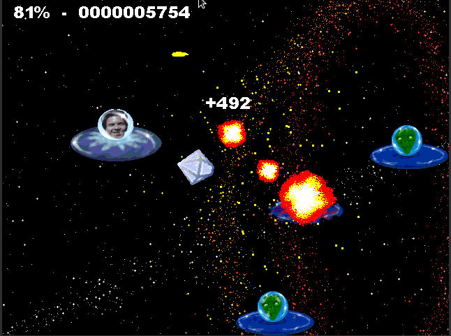
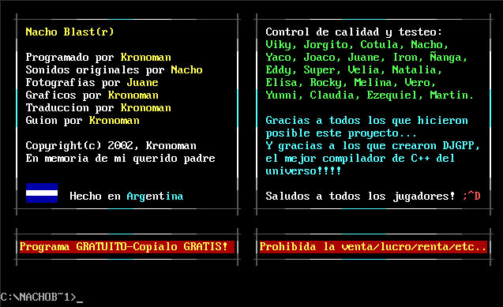
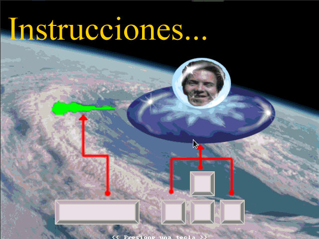
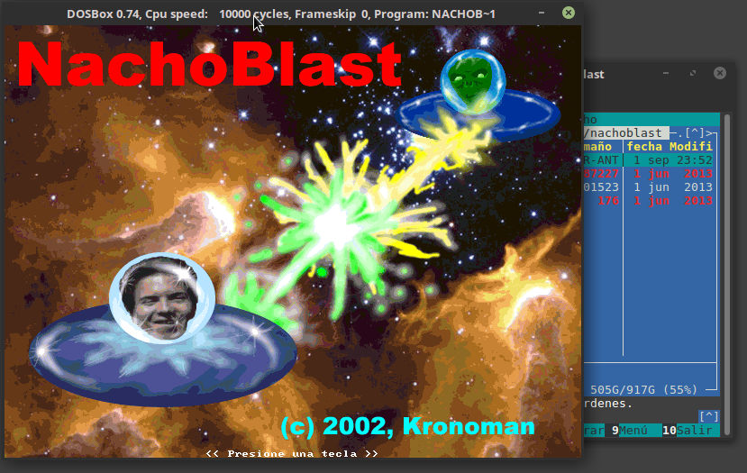

# NACHO BLASTER

Un juego de accion espacial, en honor a mi amigo **Nacho**

Programado en un 486 DX2 con 4 mb de RAM, fue realizado en C y Allegro.

Se puede jugar con el emulador DosBox (https://www.dosbox.com/), o tambien se puede compilar para Windows y Linux.

El release binario es para DOS, por lo tanto se puede jugar usando DosBox, o una maquina antigua.

Ejemplos corriendo en DosBox, en Linux

# Screenshoots

