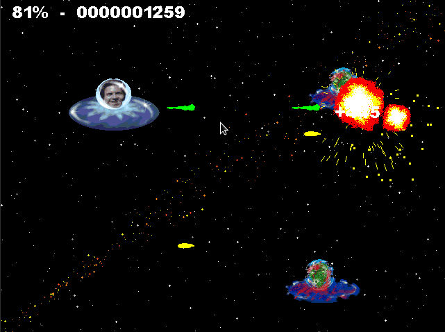

# NACHO BLASTER

Un juego de accion espacial, en honor a mi amigo **Nacho**

Año **2002**, programado en un 486 DX2 con 4 mb de RAM, fue realizado en C y Allegro.

Se puede jugar con el emulador DosBox (https://www.dosbox.com/), o tambien se puede compilar para Windows y Linux.

## Versiones

### Windows

Julio 2020, nueva version para Windows, luego de 18 años!

Compilado con Mingw32 GCC + Allegro 4.2 luego de un trabajo intenso de modificacion del codigo original de DOS.

### MS-DOS / DosBox

El release binario es para DOS, por lo tanto se puede jugar usando DosBox, o una maquina antigua.

Se compilo con DJGPP + Allegro 4.2 usando DosBox.

## Screenshoots

